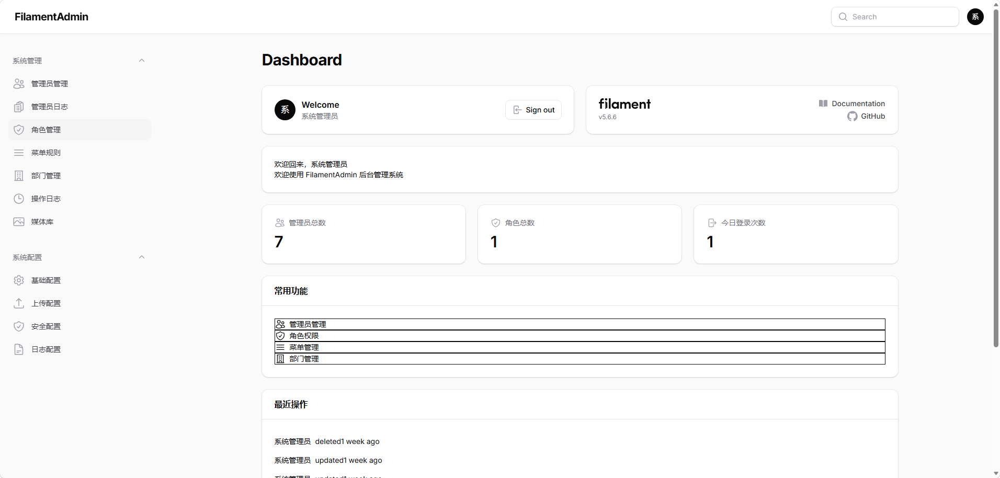

# FilamentAdmin

> 🌐 **在线体验**：https://demo.xitongapp.com  ·  演示账号 `demo@example.com` / `demo123`
> （演示环境每日凌晨 4:00 重置；高危操作已屏蔽）

基于 **Laravel 13 + Filament 5** 的 Composer 后台基础包，以 `composer require laravelstack/filament-admin` 即得一套含认证、RBAC 权限、菜单导航、操作日志、部门数据权限的企业级后台底座。

> 如果你觉得本项目对你有帮助，欢迎点 ⭐ Star 支持一下！

---

## 后台截图

<!-- 后台首页 Dashboard -->


<!-- 第二张截图：暂用后台界面填充，待替换为真正的登录页截图 art/login.png -->


---

## 核心能力

- **认证与安全**：自定义登录页（账号/邮箱双模式）、防枚举攻击、登录限流、双因素认证（TOTP）、登录日志
- **RBAC 权限**：Spatie Permission + Filament Shield 4.x、Gate::before 超管绕过、BasePolicy 自动推导
- **管理员管理**：AdminUser Resource（CRUD + 软删除 + 恢复）、状态管理、部门归属、角色分配
- **菜单导航**：树形结构、权限绑定、排序（拖拽）、数据库驱动动态导航构建
- **部门组织**：树形结构、循环引用检测、DepartmentTree 服务
- **数据权限**：5 种范围（全部 / 本部门 / 本部门及下级 / 仅本人 / 指定部门）
- **操作审计**：Spatie ActivityLog + Observer 自动记录、清理命令
- **扩展机制**：`filament-admin:publish` 命令发布 Model/Resource stub 供业务定制

---

## 快速安装

```bash
composer require laravelstack/filament-admin
```

详细安装步骤（Prerequisites + AdminPanelProvider 配置）请参阅 [wiki/installation.md](wiki/installation.md)。

---

## 仓库结构

| 目录 | 说明 |
|------|------|
| `packages/filament-admin/` | 主包（Composer 名 `laravelstack/filament-admin`，对外发布） |
| 根目录 | Laravel 演示项目，用于本地联调与发包前验收 |

- **GitHub 包仓库：** `https://github.com/john-captain/filament-admin`
- **Gitee 包仓库：** `https://gitee.com/johncaptain/filament-admin`

---

## 未来路线图

| 版本 | 计划内容 |
|------|---------|
| **v0.5（当前）** | 文档完整化、publish 命令真实可用、CI 自动化、Packagist 正式发布 |
| **v1.0** | 插件市场能力（`laravelstack/plugin-platform`）、社交登录、Docker Sail 支持 |
| **v1.5** | 官网文档站（VitePress）、国际化（i18n）、更多模块截图与演示站 |

> 以上路线图为当前规划方向，具体范围与时间以实际开发进度为准。

---

## 文档

- [安装指南（详细）](wiki/installation.md)
- [升级指南 v0.4 → v0.5](UPGRADING.md)
- [变更记录](CHANGELOG.md)
- [贡献指南](CONTRIBUTING.md)
- [包 README](packages/filament-admin/README.md)

---

## License

MIT — 详见 [LICENSE](packages/filament-admin/LICENSE)
